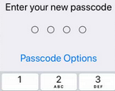
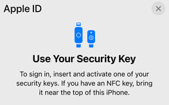

# Another iPhone Security Guide

Practical guide to better understand your iPhone and its security mechanisms.

## ⚠️ Disclaimer ⚠️

This guide is meant for **iOS 16 and later versions**. Some parts may be debatable, but it's quite common for security guides.

## What is iPhone?

The first [iPhone](https://support.apple.com/guide/iphone/welcome/ios) was released in June 2007.

It is one of the best selling products of all time, at least, in Tech. This little smartphone has changed pretty much everything in the industry and is probably the cornerstone of Apple's empire.

The latest series are powered by the Apple Silicon chip and provide interesting built-in security mechanisms.

## Notable security features of Apple Silicon chips

### Apple SoCs: security enclave

Critical security functions are isolated in a secure environment.

The chips is physically separate from the processor. It has a dedicated firmware and memory management. This aims to reduce the attack surface against software-based techniques but also physical attacks.

It also provides a secure location for storing sensitive data, such as passwords, encryption keys, and biometric information like fingerprints.

Even if the Applicaton Processor kernel is compromised, sensitive user data won't be accessible without the cryptographic keys.

[Apple: security enclave](https://support.apple.com/guide/security/secure-enclave-sec59b0b31ff/web)

### Low-level security: secure boot

Apple protects the system against known tampering attacks by only trusting approved software to load during startup.

The very first code executed by the processor (Boot ROM) is immutable.

### PACs

Pointer Authentication Codes (PACs) ensure the authenticity to mitigate memory injections and malicious code execution, like buffer overflows and ROP (Return Oriented Programming) attacks.

> Pointer authentication works by offering a special CPU instruction to add a cryptographic signature — or PAC — to unused high-order bits of a pointer before storing the pointer. Another instruction removes and authenticates the signature after reading the pointer back from memory. Any change to the stored value between the write and the read invalidates the signature. The CPU interprets authentication failure as memory corruption and sets a high-order bit in the pointer, making the pointer invalid and causing the app to crash

[Source: Apple documentation - Pointer authentication](https://developer.apple.com/documentation/security/preparing_your_app_to_work_with_pointer_authentication)

## What is iOS?

Apple has developed iOS for its iPhone and a few other products. Unlike Android, it's not an open-source project and only Apple can modify and distribute it.

However, let's skip the debate "iOS vs. Android, which one is better" that is totally off-topic here.

iOS supports a wide range of features, from facial recognition to mobile payments and many other services. It's also composed of specific security layers.

## The problematic Passcodes

Passcodes allow you to lock your iPhone with a 4 or 6-digit password, but it's a weak password by nature. You don't have to stick with the default option and can use a much much stronger passcode:

Settings > Face ID & Passcode > Change Passcode > Passcode Options > Custom Alphanumeric Code

## iOS 16: a quick review

### iPhone models compatible with iOS 16

[Read that page](https://support.apple.com/guide/iphone/supported-models-iphe3fa5df43/ios)

### Security content of iOS 16.3

[Read that page](https://support.apple.com/en-us/HT213606).

### Apple security updates

[Read that page](https://support.apple.com/en-us/HT201222)

### Notable iOS 16 security features

Beyond Face ID and other popular settings, iOS 16 provides interesting new security features:

* **Rapid Security Response**: you can activate an option to install security hotfixes automatically as soon as it's released
* **Safety Check**: shared access can be removed easily with an "emergency reset"
* **protected clipboard**: apps cannot access the clipboard without your explicit permission
* [**security keys for Apple ID**](https://support.apple.com/en-us/HT213154) (iOS 16.3)
* **hidden and recently deleted albums require authentication**: via Face ID or passcode

### The potential benefits of an opaque system

As long as users don't make crazy moves, like **jailbreaking** to install untrusted apps, the system will be hard to fool.

Apple controls the devices but also third-party applications. For now, these Apps must obtain the App Store approval, which is a very strict process that can require important modifications.

This approach has some cons we'll see later, but such limited ecosystem allows supporting older devices a bit longer.

Besides, iOS has a built-in sandboxing mechanism that restricts apps to specific resources and data, and the system encrypts passwords and other sensitive information automatically.

This tends to make classic attacks more challenging. Besides, Apple enables many advanced security features by default, unlike other systems.

### iOS 16 Lockdown Mode

[The LockDown mode](https://support.apple.com/en-us/HT212650) is marketed as an "extreme protection" for individuals who might be targeted by very sophisticated adversaries.

When enabled, the surface attack is drastically reduced to the point that some features may no longer work:

* most message attachments are blocked
* links and link previews are disabled
* explicit approval is required to unlock accessories or connected computers
* shared Albums are hidden and disabled
* web browsing technology is restricted

Indeed, the LockDown mode is not meant for everybody, but Apple seems to target high-risk profiles, a.k.a non-standard users with a specific threat model, like activists, journalists, or even political dissidents.

PortSwigger [reported](https://portswigger.net/daily-swig/lockdown-mode-apple-offers-2m-bug-bounty-for-vulnerabilities-in-new-anti-spyware-tech) that Apple has offered a huge reward (up to $2m!) for a working LockdDown Mode bypass.

The company is targeting mercernary enterprises like NSO that successfully defeated the so-called "unbreakable" iPhone in the past (e.g., with the Pegasus software).

However, these sophisticated actors are constantly working on new exploits, and can leverage _alternative_ markets for iOS zero-days and zero-click exploits [^1].

While the LockDown mode is undeniably restrictive, it cannot cover all vulnerabilities. 

It's unlikely individuals can fight against global actors using just their smartphones! Would nation states even allow such products?!

[^1]: 0-days are vulnerabilities that remain unknown or unpatched by those who should be interested in their mitigation (e.g., vendors, developers), and zero-click attacks often leverage 0-days to infect the victims without any user interaction.

### iOS is not exactly Wonderland

Apple aims to bring war to advanced attackers but may create the perfect conditions for them: it might be harder for inexperienced criminals to attack, but defenders and security researchers might also fail to detect and mitigate advanced threats.

In the [macOS security guide](https://github.com/jmau111-org/macos_security), we see that Apple products are pretty secure against the average criminal but it may attract more advanced attackers.

Many security researchers struggle to find relevant documentation for important components and some compare Apple's products to "black boxes."

Another big caveat is that iOS users are tied to Apple. If the company misses a critical vulnerability or makes bad decisions, there's very little, perhaps nothing you can do about it.

### The latest versions are not immune to attacks

Trellix researcher Austin Emmitt recently discovered new vulnerabilities and declared:

> [These new vulnerabilities] represent a significant breach of the security model of macOS and iOS which relies on individual applications having fine-grained access to the subset of resources they need and querying higher privileged services to get anything else

[Source: Hackernews](https://thehackernews.com/2023/02/apple-warns-of-3-new-vulnerabilities.html)

## How to secure iPhones

### iPhone privacy basics

You can opt out of various telemetries during the first install, but in case you missed it, here are some reminders:

- [x] disable "Privacy preserving ad measurement" (Settings > Safari > Privacy preserving ad measurement), which is a misleading setting
- [x] disable "Check for Apple Pay" (Settings > Safari > Check for Apple Pay)
- [x] set "deny," or, at least, "ask" in "Settings for websites" in Safari (Settings > Safari > Settings for websites: location, microphone, etc)
- [x] disable all Siri options if you don't need Siri (Settings > Siri & Search)
- [x] disable analytics (Settings > Analytics & Improvments)
- [x] disable Apple ads (Settings > Apple Advertising > Personalized Ads)
- [x] remove unused Apps, including pre-packaged apps like "Weather" or "TV"
- [x] disable fitness tracking (Settings > Motion & Fitness > Fitness tracking)
- [x] disable location tracking (Settings > Privacy and Security > Location Services)
- [x] disable app tracking (Settings > Privacy and Security > Tracking > Allow Apps to Request to Track)
- [x] hide your IP from trackers in Safari (Settings > Safari > Hide IP Address)
- [x] restrict app access to your local network (Settings > Privacy and Security > Local Network)
- [x] add a [camera cover](https://www.amazon.com/iphone-case-camera-cover/s?k=iphone+case+camera+cover)

Apple lets you review app permissions with some granularity, so review it regularly: Settings > Privacy and Security. Unfortunately, it's a bit time-consuming, as you'll probably have to review each app, one by one, but it's worth it.

Tracking is not free in terms of privacy, but also for the battery. It can literally drain your power, so only enable it when it's necessary, and you don't have to give a permanent access.

### iPhone security basics

- [x] **don't** Jailbreak (unless you run the system as a security researcher or an iOS developer, but be aware of the consequences)
- [x] use a password manager (e.g., 1P)
- [x] enable automatic updates and security hotfixes (Settings > General > Software Update > Automatic Updates)
- [x] keep all apps up-to-date
- [x] use an Alphanumeric Passcode instead of digits (Settings > Face ID & Passcode > Change Passcode > Passcode Options > Custom Alphanumeric Code)
- [x] disable **all** options for lock screen (Settings > Face ID & Passcode > Allow access when locked)
- [x] don't click on links in unsollicited messages
- [x] review app permissions (Settings > Privacy and Security)
- [x] review third-party apps carefully **before** installing them: look at the ratings, the number of downloads, etc
- [x] use a strong Apple ID password and change it regularly
- [x] remove unused Apps
- [x] filter unknown senders (Settings > Messages > Filter Unknown Senders)
- [x] disable Bluetooth if you don't need it (Settings > Bluetooth)
- [x] don't stay in Bluetooth settings (Settings > Bluetooth) while it's enabled, as your device is in discoverable mode
- [x] disable WiFi if you don't need it (Settings > WiFi)
- [x] disable WiFi auto-join networks and hostspots (Settings > WiFi)
- [x] disable AirDrop if you don't need it (Settings > General > AirDrop)
- [x] disable automatic discover to nearby AirPlay if you don't need it (Settings > General > AirPlay & Handoff > Automatically AirPlay to TV)
- [x] auto-lock the screen (Settings > Display & Brightness > Auto-Lock)

### In doubt

⚠️ Some of the following measures might be too extreme or insufficient, perhaps inappropriate (check your threat model):

- [x] use use Face ID or Touch ID in public
- [x] run a "Safety check" (Settings > Privacy and Security > Safety Check)
- [x] inspect the battery health and activity (Settings > Battery)
- [x] delete credit cards and other payments (Settings > Wallet & Apple Pay)
- [x] use CarPlay only in USB mode and not Bluetooth (wireless) to avoid Car Whisperer attacks (Settings > General > CarPlay)
- [ ] cover your screen when entering your passcode in public
- [ ] switch to Airplane mode
- [ ] use hardwarde security keys for your Apple ID (see https://support.apple.com/en-us/HT213154)
- [ ] use [Signal](https://apps.apple.com/us/app/signal-private-messenger/id874139669)
- [ ] enable anti brute-force: erase data after 10 failed passcode attempts (Settings > Face ID & Passcode > Erase Data) [^2]
- [ ] run a factory reset (Settings > General > Reset > Erase all content and settings)
- [ ] enable [LockDown Mode](#ios-16-lockdown-mode) (Settings > Privacy and Security > Safety Check)

[^2]: ensure you backup your data regularly (e.g., using iCloud) if you enable this option

## About hardware security keys

Most phishing attacks against Apple IDs aim to steal credentials remotely, and OTP codes (One-Time passwords) can be stolen with SIM jacking or SIM swapping. 

Simple old classic theft can also do the job, as the iPhone holds the authentication factor. Now if you enable security keys, which are physical devices that may look like USB drives or NFC accessories, this is not the same story.

You will have to set 2 keys in the settings, as Apple requires an emergency key in case you lose the first one, but it's quite straightforward.

## iOS for developers and security pros

### Keychain

Roughly speaking, it is how iOS securely stores passwords, authentication tokens, and other sensitive information. In other words, it aims to prevent unauthorized access.

iOS developers are invited to use Keychain to store and retrieve encrypted data, and not `UserDefaults` (user preferences in unencrypted plist files). Because it's not trivial, some frameworks like [CryptoSwift](https://github.com/krzyzanowskim/CryptoSwift) can help.

The Keychain is supposed to be accessible only to the app that created the data or other apps or services from the same developer or organization. In addition, the user has to grant permission, which requires a passcode, Touch ID, or Face ID.

The Keychain Services API can be used to save various sensitive data:

* user metadata
* passwords
* credit cards
* sensitive notes
* cryptographic keys
* certificates

### Anti-Jailbreak

Jailbroken iPhones are prone to attacks. Developers may add an extra layer of security to their apps by detecting those risky environments.

There is no official method, but you may leverage commons apps installed on Jailbroken devices, like [Cydia](https://www.cydiacloud.com/jailbreak/). Note that programs like Cydia can be hidden, so an alternative approach could consist of testing apps that are notoriously broken by Jailbreak.

There used to be an App called "System and Security Info" to run such diagnostic, but Apple [killed it](https://www.digitaltrends.com/mobile/system-and-security-info-iphone-app-news/) in 2016.

This [repo](https://github.com/vadim-a-yegorov/Jailbreak-detection-The-modern-way) may provide some hints, though.

### Getting started with iPhone Forensics

[MVT](https://github.com/mvt-project/mvt) (Mobile Verification Toolkit) can help detect advanced compromises on iOS devices (e.g., Pegasus software).

## Going further

* [Apple Security Bug Bounty Program](https://security.apple.com/bounty/)
* [Apple Security Guides](https://support.apple.com/en-gb/guide/security/welcome/web)
* [iOS Pentesting](https://book.hacktricks.xyz/mobile-pentesting/ios-pentesting)
* [iOS Forensics](https://resources.infosecinstitute.com/topic/ios-forensics/)
* [macOS iOS Security](https://github.com/houjingyi233/macOS-iOS-system-security)
* [Awesome iOS resources](https://github.com/gopalkrishnareddy/awesome-iOS-resource)
* [iOS Security Suite](https://github.com/securing/IOSSecuritySuite)
* [Open-source iOS Apps](https://github.com/dkhamsing/open-source-ios-apps)
* [privacytools.io](https://www.privacytools.io/)
